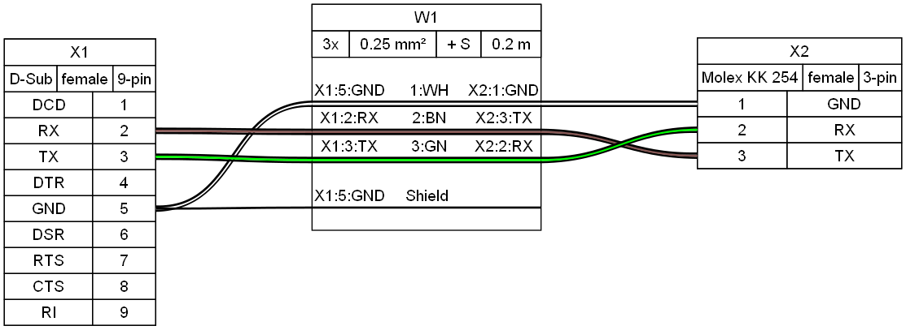

# WireViz

## Summary

WireViz is a tool for easily documenting cables, wiring harnesses and connector pinouts. It takes plain text, YAML-formatted files as input and produces beautiful graphical output (SVG, PNG, ...) thanks to [GraphViz](https://www.graphviz.org/). It handles automatic BOM (Bill of Materials) creation and has a lot of extra features.

## Features

* WireViz input files are fully text based
  * No special editor required
  * Human readable
  * Easy version control
  * YAML syntax
  * UTF-8 input and output files for special character support
* Understands and uses color abbreviations as per [IEC 60757](https://en.wikipedia.org/wiki/Electronic_color_code#Color_band_system) (black=BK, red=RD, ...)
  * Optionally outputs colors as abbreviation (e.g. 'YE'), full name (e.g. 'yellow') or hex value (e.g. '#ffff00'), with choice of UPPER or lower case
* Auto-generates standard wire color schemes and allows custom ones if needed
  * [DIN 47100](https://en.wikipedia.org/wiki/DIN_47100) (WT/BN/GN/YE/GY/PK/BU/RD/BK/VT/...)
  * [IEC 62](https://en.wikipedia.org/wiki/Electronic_color_code#Color_band_system)   (BN/RD/OR/YE/GN/BU/VT/GY/WT/BK/...)
  * [25 Pair Color Code](https://en.wikipedia.org/wiki/25-pair_color_code#Color_coding) (BUWH/WHBU/OGWH/WHOG/GNWH/WHGN/BNWH/...)
  * [TIA/EIA 568 A/B](https://en.wikipedia.org/wiki/TIA/EIA-568#Wiring)  (Subset of 25-Pair, used in CAT-5/6/...)
* Understands wire gauge in mm² or AWG
  * Optionally auto-calculates equivalent gauge between mm² and AWG
* Allows more than one connector per side, as well as loopbacks
* Allows for easy-autorouting for 1-to-1 wiring
* Generates BOM (Bill of Materials)

_Note_: WireViz is not designed to represent the complete wiring of a system. Its main aim is to document the construction of individual wires and harnesses.

## Installation

WireWiz requires GraphViz to be installed in order to work. See the [GraphViz download page](https://graphviz.org/download/) for OS-specific instructions.

Installation of the WireWiz package and its Python dependencies can be done using pip after cloning the repository:

```
git clone <repo url>
cd <working copy>
pip3 install -e .
```

## Examples

### Demo 01

[WireViz input file](examples/demo01.yml):

```yaml
connectors:
  X1:
    type: D-Sub
    subtype: female
    pinlabels: [DCD, RX, TX, DTR, GND, DSR, RTS, CTS, RI]
  X2:
    type: Molex KK 254
    subtype: female
    pinlabels: [GND, RX, TX]

cables:
  W1:
    gauge: 0.25 mm2
    length: 0.2
    color_code: DIN
    wirecount: 3
    shield: true

connections:
  -
    - X1: [5,2,3]
    - W1: [1,2,3]
    - X2: [1,3,2]
  -
    - X1: 5
    - W1: s
```

Output file:



[Bill of Materials](examples/demo01.bom.tsv) (auto-generated)

### Demo 02


[Source](examples/demo02.yml) - [Bill of Materials](examples/demo02.bom.tsv)

### Tutorial and example gallery

See the [tutorial page](tutorial/readme.md) for sample code,
as well as the [example gallery](examples/readme.md) to see more of what WireViz can do.

## Usage

```
$ wireviz ~/path/to/file/mywire.yml
```

This will output the following files

```
mywire.gv         GraphViz output
mywire.svg        Wiring diagram as vector image
mywire.png        Wiring diagram as raster image
mywire.bom.tsv    BOM (bill of materials) as tab-separated text file
mywire.html       HTML page with wiring diagram and BOM embedded
```

### (Re-)Building the example projects

If you would like to rebuild all of the included demos, examples and tutorials, use the ```build_examples.py``` script:

```cd src/wireviz
./build_examples.py

```

## Changelog

See [CHANGELOG.md](CHANGELOG.md)

## Status

This is very much a [work in progress](https://github.com/formatc1702/WireViz/projects/1). Source code, API, syntax and functionality may change wildly at any time.

## Requirements

Developed and tested using Python 3.7; might not work with older Python versions.

Ubuntu 18.04 LTS users in particular may need to separately install Python 3.7 or above, as that comes with Python 3.6 as the included system Python install.

## License

[GPL-3.0](LICENSE)
