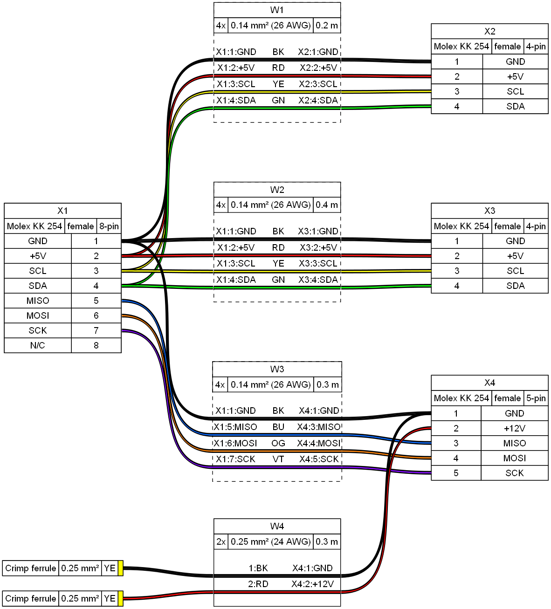

# WireViz


[](https://pypi.org/project/wireviz/)
[](https://pypi.org/project/wireviz/)
[](https://pypi.org/project/wireviz/)
[](https://github.com/psf/black)

## Summary

WireViz is a tool for easily documenting cables, wiring harnesses and connector pinouts. It takes plain text, YAML-formatted files as input and produces beautiful graphical output (SVG, PNG, ...) thanks to [GraphViz](https://www.graphviz.org/). It handles automatic BOM (Bill of Materials) creation and has a lot of extra features.


## Features

* WireViz input files are fully text based
  * No special editor required
  * Human readable
  * Easy version control
  * YAML syntax
  * UTF-8 input and output files for special character support
* Understands and uses color abbreviations as per [IEC 60757](https://en.wikipedia.org/wiki/Electronic_color_code#Color_band_system) (black=BK, red=RD, ...)
  <!-- * Optionally outputs colors as abbreviation (e.g. 'YE'), full name (e.g. 'yellow') or hex value (e.g. '#ffff00'), with choice of UPPER or lower case (#158) -->
* Auto-generates standard wire color schemes and allows custom ones if needed
  * [DIN 47100](https://en.wikipedia.org/wiki/DIN_47100) (WT/BN/GN/YE/GY/PK/BU/RD/BK/VT/...)
  * [IEC 60757](https://en.wikipedia.org/wiki/Electronic_color_code#Color_band_system)   (BN/RD/OR/YE/GN/BU/VT/GY/WT/BK/...)
  * [25 Pair Color Code](https://en.wikipedia.org/wiki/25-pair_color_code#Color_coding) (BUWH/WHBU/OGWH/WHOG/GNWH/WHGN/BNWH/...)
  * [TIA/EIA 568 A/B](https://en.wikipedia.org/wiki/TIA/EIA-568#Wiring)  (Subset of 25-Pair, used in CAT-5/6/...)
* Understands wire gauge in mm² or AWG
  * Optionally auto-calculates equivalent gauge between mm² and AWG
* Is suitable for both very simple cables, and more complex harnesses.
* Allows for easy-autorouting for 1-to-1 wiring
* Generates BOM (Bill of Materials)

_Note_: WireViz is not designed to represent the complete wiring of a system. Its main aim is to document the construction of individual wires and harnesses.


## Examples

### Demo 01

[WireViz input file](../examples/demo01.yml):

```yaml
connectors:
  X1:
    type: D-Sub
    subtype: female
    pinlabels: [DCD, RX, TX, DTR, GND, DSR, RTS, CTS, RI]
  X2:
    type: Molex KK 254
    subtype: female
    pinlabels: [GND, RX, TX]

cables:
  W1:
    gauge: 0.25 mm2
    length: 0.2
    color_code: DIN
    wirecount: 3
    shield: true

connections:
  -
    - X1: [5,2,3]
    - W1: [1,2,3]
    - X2: [1,3,2]
  -
    - X1: 5
    - W1: s
```

Output file:


[Bill of Materials](../examples/demo01.tsv) (auto-generated)

### Demo 02



[Source](../examples/demo02.yml) - [Bill of Materials](../examples/demo02.tsv)

### Syntax, tutorial and example gallery

Read the [syntax description](syntax.md) to learn about WireViz' features and how to use them.

See the [tutorial page](../tutorial/readme.md) for sample code, as well as the [example gallery](../examples/readme.md) to see more of what WireViz can do.


## Usage

### Installation

#### Requirements

WireViz requires Python 3.7 or later.

WireWiz requires GraphViz to be installed in order to work. See the [GraphViz download page](https://graphviz.org/download/) for OS-specific instructions.

_Note_: Ubuntu 18.04 LTS users in particular may need to separately install Python 3.7 or above, as that comes with Python 3.6 as the included system Python install.

#### Installing the latest release

The latest WireViz release can be downloaded from [PyPI](https://pypi.org/project/wireviz/) with the following command:
```
pip3 install wireviz
```

#### Installing the development version

Access to the current state of the development branch can be gained by cloning the repo and installing manually:

```
git clone <repo url>
cd <working copy>
git checkout dev
pip3 install -e .
```

If you would like to contribute to this project, make sure you read the [contribution guidelines](CONTRIBUTING.md)!

### How to run

```
$ wireviz ~/path/to/file/mywire.yml
```

Depending on the options specified, this will output some or all of the following files:

```
mywire.gv         GraphViz output
mywire.svg        Wiring diagram as vector image
mywire.png        Wiring diagram as raster image
mywire.tsv        BOM (bill of materials) as tab-separated text file
mywire.html       HTML page with wiring diagram and BOM embedded
```

Wildcars in the file path are also supported to process multiple files at once, e.g.:
```
$ wireviz ~/path/to/files/*.yml
```

To see how to specify the output formats, as well as additional options, run:

```
$ wireviz --help
```


### (Re-)Building the example projects

Please see the [documentation](buildscript.md) of the `build_examples.py` script for info on building the demos, examples and tutorial.

## Changelog

See [CHANGELOG.md](CHANGELOG.md)


## Status

This is very much a work in progress. Source code, API, syntax and functionality may change wildly at any time.


## License

[GPL-3.0](../LICENSE)
