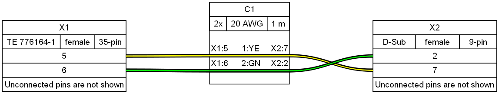
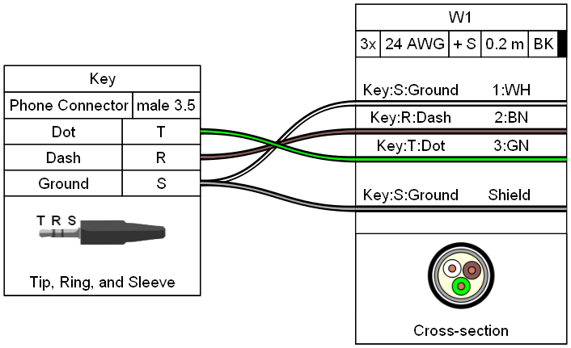
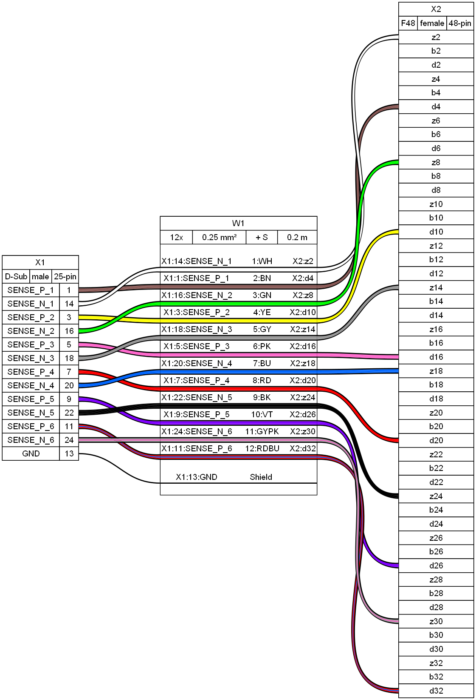

# Example Gallery

## Example 01

[Source](ex01.yml) - [Bill of Materials](ex01.bom.tsv)

## Example 02

[Source](ex02.yml) - [Bill of Materials](ex02.bom.tsv)

## Example 03

[Source](ex03.yml) - [Bill of Materials](ex03.bom.tsv)

## Example 04

[Source](ex04.yml) - [Bill of Materials](ex04.bom.tsv)

## Example 05

[Source](ex05.yml) - [Bill of Materials](ex05.bom.tsv)

## Example 06

[Source](ex06.yml) - [Bill of Materials](ex06.bom.tsv)

## Example 07

[Source](ex07.yml) - [Bill of Materials](ex07.bom.tsv)

## Example 08

[Source](ex08.yml) - [Bill of Materials](ex08.bom.tsv)

## Example 09

[Source](ex09.yml) - [Bill of Materials](ex09.bom.tsv)

## Example 10

[Source](ex10.yml) - [Bill of Materials](ex10.bom.tsv)

