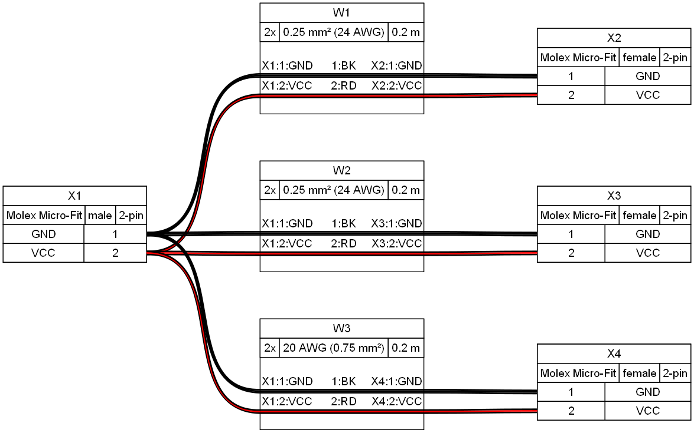
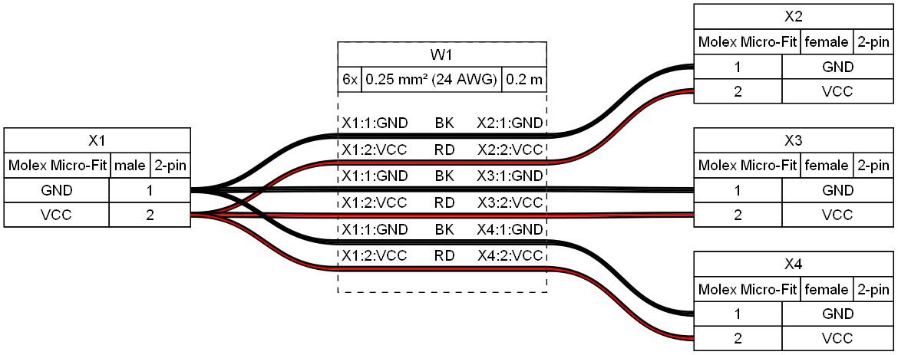
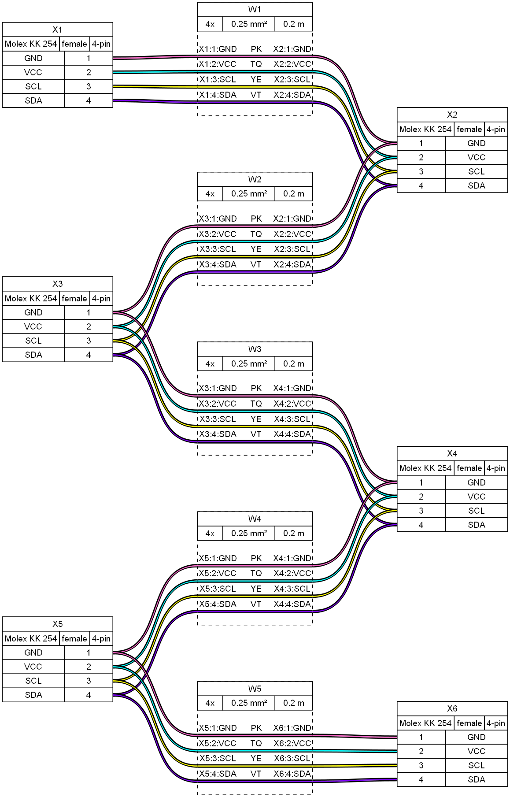
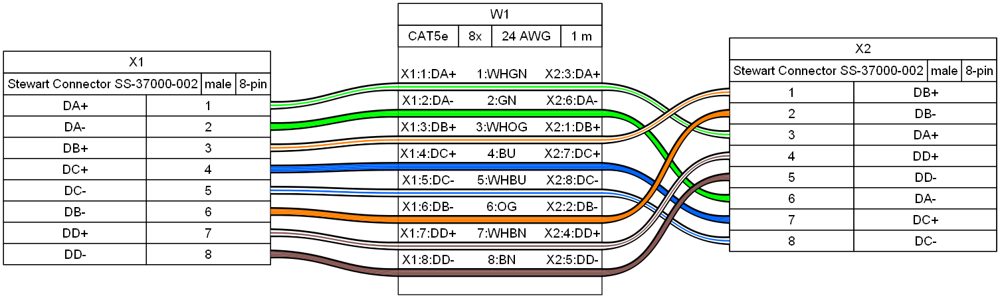
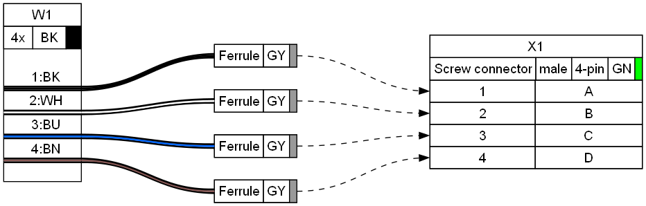
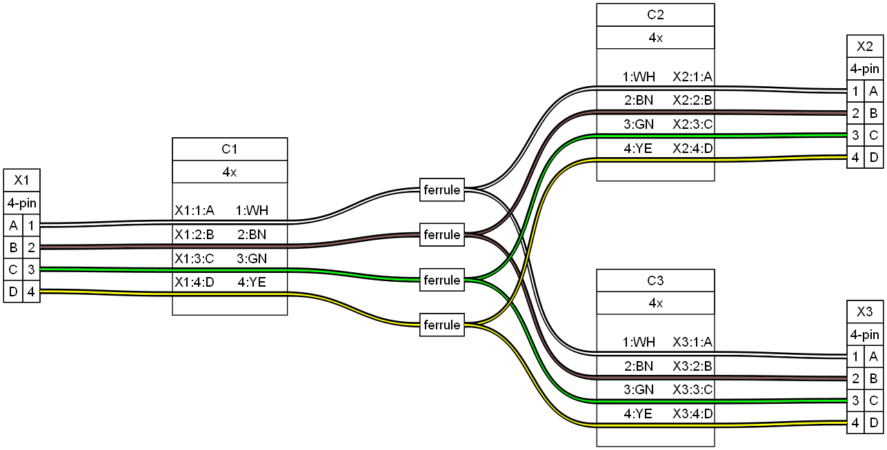
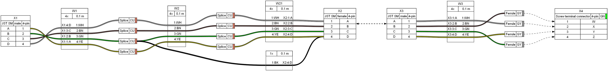
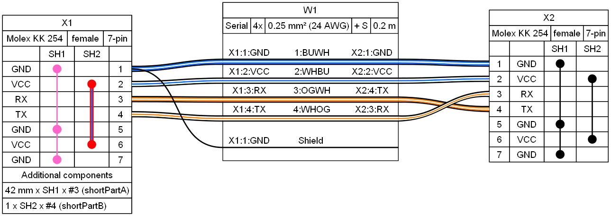
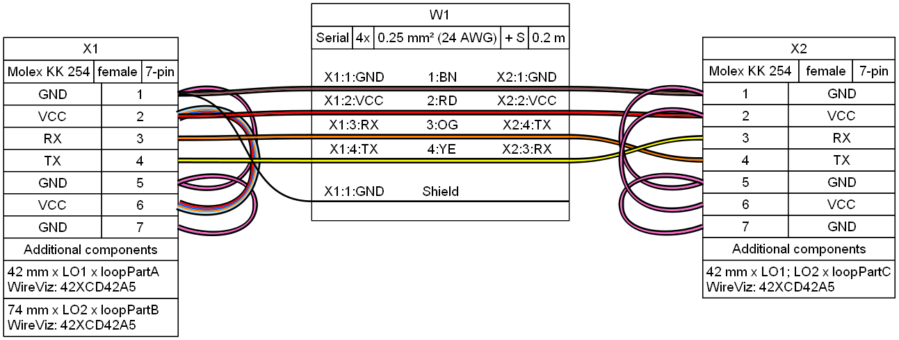

# Example Gallery

## Example 01

[Source](ex01.yml) - [Bill of Materials](ex01.tsv)

## Example 02

[Source](ex02.yml) - [Bill of Materials](ex02.tsv)

## Example 03

[Source](ex03.yml) - [Bill of Materials](ex03.tsv)

## Example 04

[Source](ex04.yml) - [Bill of Materials](ex04.tsv)

## Example 05

[Source](ex05.yml) - [Bill of Materials](ex05.tsv)

## Example 06

[Source](ex06.yml) - [Bill of Materials](ex06.tsv)

## Example 07

[Source](ex07.yml) - [Bill of Materials](ex07.tsv)

## Example 08

[Source](ex08.yml) - [Bill of Materials](ex08.tsv)

## Example 09

[Source](ex09.yml) - [Bill of Materials](ex09.tsv)

## Example 10

[Source](ex10.yml) - [Bill of Materials](ex10.tsv)

## Example 11

[Source](ex11.yml) - [Bill of Materials](ex11.tsv)

## Example 12

[Source](ex12.yml) - [Bill of Materials](ex12.tsv)

## Example 13

[Source](ex13.yml) - [Bill of Materials](ex13.tsv)

## Example 14

[Source](ex14.yml) - [Bill of Materials](ex14.tsv)

## Example 15

[Source](ex15.yml) - [Bill of Materials](ex15.tsv)

## Example 16

[Source](ex16.yml) - [Bill of Materials](ex16.tsv)

