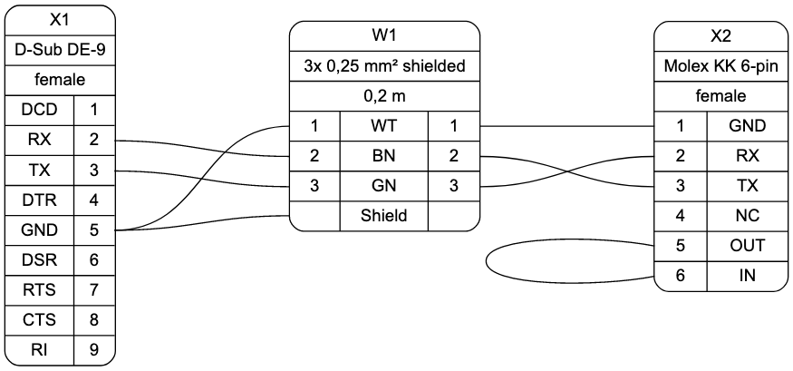

# WireViz

## Summary

WireViz is a simple yet flexible markup language for documenting wires and connector pinouts with beautiful graphical output.

It is based on GraphViz and designed as an "extension" of it. A parser reads a WireViz file and generates valid GraphViz output, which can instantly be rendered to SVG/PNG.

## Features

* WireViz is fully text based
  * No special editor required
  * Human readable
  * Easy version control
  * GraphViz-like syntax
* Auto-generates standard wire color schemes and allows custom ones if needed
  * DIN 47100 (WT/BN/GN/YE/GY/PK/BU/RD/BK/VT/...)
  * IEC ???   (BN/RD/OR/YE/GN/BU/VT/GY/WT/BK/...)
* Allows more than one connector per side, as well as loopbacks
* Will include images of known connectors, together with their pinouts

## Example

WireViz input file:

    // define connectors

    X1 [type="D-Sub DE-9",
        subtype="female",
        num_pins=9,
        pin_labels="DCD|RX|TX|DTR|GND|DSR|RTS|CTS|RI",
        position=L
       ]

    X2 [type="Molex KK 254 6-pin",
        subtype="female",
        num_pins=6,
        pin_labels="GND|RX|TX|NC|OUT|IN",
        position=R
       ]

    // define wire

    W1 [type="3x 0,25 mm² shielded",
        length="0.2m",
        num_wires=3,
        colors="din47100",
        shield=true
       ]

    // define connections

    X1:5 -> W1:1 -> X2:1  // GND
    X1:2 -> W1:2 -> X2:3  // TX-RX
    X1:3 -> W1:3 -> X2:2  // RX-TX
    X1:5 -> W1:S          // shield
    X2:5 -> X2:6          // loop

Output file:

GraphViz code generated by parser:

    digraph G {
        graph [rankdir = LR, ranksep=2, fontname = "arial"];
        edge [arrowhead=none, fontname = "arial"];
        node [shape=record, style=rounded, fontname = "arial"];

        X1[label="X1 | D-Sub DE-9 | female | {{DCD|RX|TX|DTR|GND|DSR|RTS|CTS|RI} | {<p1>1|<p2>2|<p3>3|<p4>4|<p5>5|<p6>6|<p7>7|<p8>8|<p9>9}} "];
        X2[label="X2 | Molex KK 254 6-pin | female | {{<p1>1|<p2>2|<p3>3|<p4>4|<p5>5|<p6>6} | {GND|RX|TX|NC|OUT|IN}}"];

        W1[label="W1 | 3x 0,25 mm² shielded | 0.2 m | {{<w1i>1|<w2i>2|<w3i>3|<wsi>}|{WT|BN|GN|Shield}|{<w1o>1|<w2o>2|<w3o>3|<wsi>}}}"];

        {edge[style=bold]
            {edge[color="#000000:#ffffff:#000000"] X1:p5 -> W1:w1i; W1:w1o -> X2:p1; }
            {edge[color="#000000:#666600:#000000"] X1:p2 -> W1:w2i; W1:w2o -> X2:p3; }
            {edge[color="#000000:#00ff00:#000000"] X1:p3 -> W1:w3i; W1:w3o -> X2:p2; }
            X1:p5 -> W1:wsi;
            X2:p5:w -> X2:p6:w;
        }
    }

## Status

This is very much a work in progress, and mainly an idea in my head.
