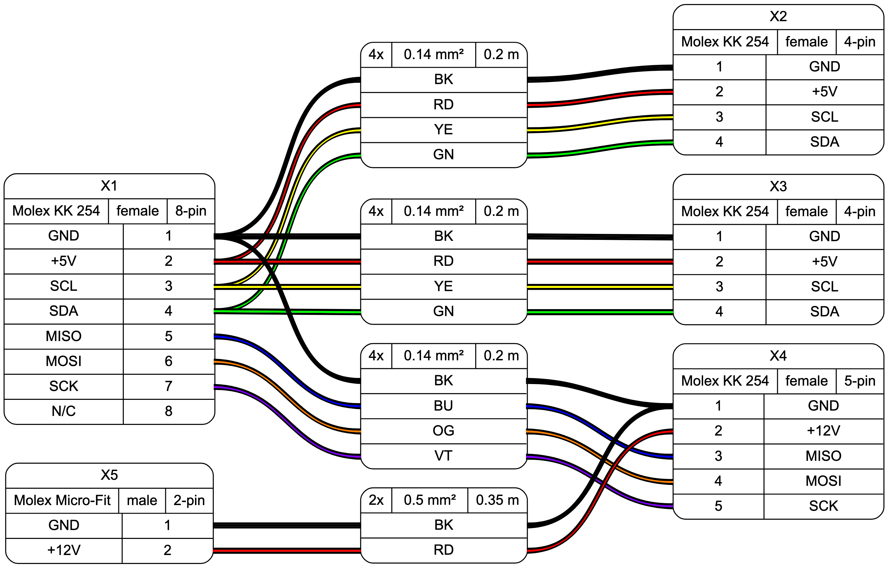

# WireViz

## Summary

WireViz is a simple yet flexible markup language for documenting cables, wiring harnesses and connector pinouts with beautiful graphical output.

It is based on [GraphViz](https://www.graphviz.org/) and designed as an "extension" of it. A parser reads a WireViz file and generates valid GraphViz output, which can instantly be rendered to SVG/PNG.

## Features

* WireViz is fully text based
  * No special editor required
  * Human readable
  * Easy version control
  * GraphViz-like syntax
* Understands and uses color abbreviations as per [IEC 60757](https://en.wikipedia.org/wiki/Electronic_color_code#Color_band_system) (black=BK, red=RD, ...)
  * Optionally outputs colors as abbreviation (e.g. 'YE'), full name (e.g. 'yellow') or hex value (e.g. '#ffff00'), with choice of UPPER or lower case
* Auto-generates standard wire color schemes and allows custom ones if needed
  * [DIN 47100](https://en.wikipedia.org/wiki/DIN_47100) (WT/BN/GN/YE/GY/PK/BU/RD/BK/VT/...)
  * [IEC 62](https://en.wikipedia.org/wiki/Electronic_color_code#Color_band_system)   (BN/RD/OR/YE/GN/BU/VT/GY/WT/BK/...)
* Understands wire gauge in mm² or AWG
  * Optionally auto-calculates and displays AWG equivalent when specifying mm²
* Allows more than one connector per side, as well as loopbacks
* Allows for easy-autorouting for 1-to-1 wiring

## Example

WireViz input file:

    // define connectors

    X1 [type="D-Sub",
        gender="female",
        pin_labels="DCD|RX|TX|DTR|GND|DSR|RTS|CTS|RI",
       ]

    X2 [type="Molex KK 254",
        gender="female",
        pin_labels="GND|RX|TX|NC|OUT|IN",
       ]

    // define wire

    W1 [mm2=0.25,
        length=0.2,
        num_wires=3,
        colors="din47100",
        shield=true
       ]

    // define connections

    X1:5 -> W1:1 -> X2:1  // GND
    X1:2 -> W1:2 -> X2:3  // TX-RX
    X1:3 -> W1:3 -> X2:2  // RX-TX
    X1:5 -> W1:S          // shield
    X2:5 -> X2:6          // loop

Output file:

GraphViz code generated by parser:

    digraph G {
        graph [rankdir = LR, ranksep=2, fontname = "arial"];
        edge [arrowhead=none, fontname = "arial"];
        node [shape=record, style=rounded, fontname = "arial"];

    X1[label="X1 | {D-Sub DE-9|female|9-pin} | {{DCD|RX|TX|DTR|GND|DSR|RTS|CTS|RI} | {<p1>1|<p2>2|<p3>3|<p4>4|<p5>5|<p6>6|<p7>7|<p8>8|<p9>9}}}"]

    X2[label="X2 | {Molex KK 254|female|6-pin} | {{<p1>1|<p2>2|<p3>3|<p4>4|<p5>5|<p6>6} | {|||||}}}"]

    {edge[style=bold]
    X2:p5:w -> X2:p6:w
    }

    W1[label="W1 | {3x|0.25 mm²| + S|0.2 m} | {{<w1i>1|<w2i>2|<w3i>3|<wsi>} | {WH|BN|GN|Shield} | {<w1o>1|<w2o>2|<w3o>3|<wso>}}}"]

    {edge[style=bold]
    {edge[color="#000000:#ffffff:#000000"] X1:p5 -> W1:w1i; W1:w1o -> X2:p1}
    {edge[color="#000000:#666600:#000000"] X1:p2 -> W1:w2i; W1:w2o -> X2:p3}
    {edge[color="#000000:#00ff00:#000000"] X1:p3 -> W1:w3i; W1:w3o -> X2:p2}
    {X1:p5 -> W1:wsi; }
    }

    }

[Example 2](idea/example2.dot)

## Status

This is very much a work in progress.
A Python module and test scripts are available. Running the test script will generate GraphViz output.
The parser will follow later; contributions are welcome!

## To do

* Automate creation of left/right side ports for connectors
* Add simple connectors (ferrules, cable lugs)
  * no pinout
  * graphical representation?
* Add support for cable splicing (as connector type)
* Display picture of connector underneath (including pin 1 location)
* Create parser (to make WireViz work as a GraphViz extension)
* Automatic BOM generation

## License

GNU GPLv3
