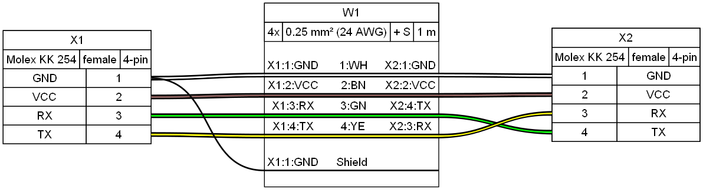
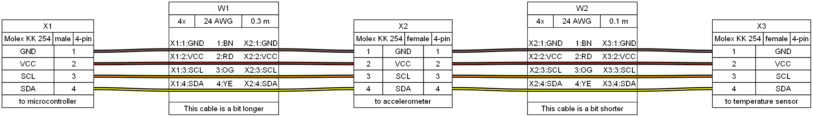
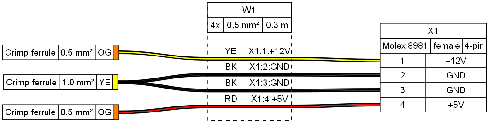
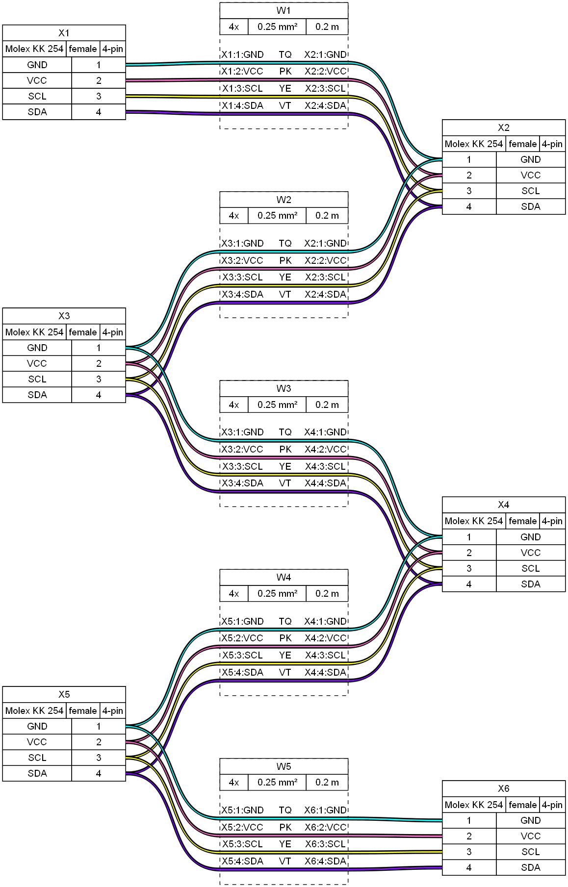

# WireViz Tutorial
## Bare-bones example

* Minimum working example
* Only 1-to-1 sequential wiring

[Source](tutorial01.yml):

    connectors:
      X1:
        pincount: 4
      X2:
        pincount: 4
    
    cables:
      W1:
        wirecount: 4
        length: 1
    
    connections:
      -
        - X1: [1-4]
        - W1: [1-4]
        - X2: [1-4]

Output:

## Adding parameters and colors

* Parameters for connectors and cables
* Auto-calculate AWG from mm2
* Non-sequential wiring

[Source](tutorial02.yml):

    connectors:
      X1:
        pincount: 4
        # More connector parameters:
        type: Molex KK 254
        subtype: female
      X2:
        pincount: 4
        type: Molex KK 254
        subtype: female
    
    cables:
      W1:
        wirecount: 4
        # more cable parameters:
        length: 1
        gauge: 0.25 mm2
        show_equiv: true
        colors: [WH, BN, GN, YE]
    
    connections:
      -
        - X1: [1-4]
        - W1: [1-4]
        # non-sequential wiring:
        - X2: [1,2,4,3]

Output:

## Pinouts, shielding, templates (I)

* Connector pinouts
  * Pincount implicit in pinout
* Cable color codes
* Cable shielding, shield wiring
* Templates

[Source](tutorial03.yml):

    connectors:
      X1: &template1 # define a template for later use
        pinout: [GND, VCC, RX, TX] # pincount implicit in pinout
        type: Molex KK 254
        subtype: female
      X2:
        <<: *template1 # reuse template
    
    cables:
      W1:
        wirecount: 4
        length: 1
        gauge: 0.25 mm2
        show_equiv: true
        color_code: DIN # auto-assign colors based on DIN 47100
        shield: true # add cable shielding
    
    connections:
      -
        - X1: [1-4]
        - W1: [1-4]
        - X2: [1,2,4,3]
      - # connect the shielding to a pin
        - X1: 1
        - W1: s

Output:

## Templates (II), American standards, daisy chaining (I)

* Overriding template parameters
* American standards: AWG gauge and IEC colors
* Linear daisy-chain

[Source](tutorial04.yml):

    connectors:
      X1: &template_con
        pinout: [GND, VCC, SCL, SDA]
        type: Molex KK 254
        subtype: male
        notes: to microcontroller # add notes
      X2:
        <<: *template_con # use template
        subtype: female   # but override certain parameters
        notes: to accelerometer
      X3:
        <<: *template_con
        subtype: female
        notes: to temperature sensor
    
    cables:
      W1: &template_cbl
        wirecount: 4
        length: 0.3
        gauge: 24 AWG # specifying guage in AWG directly
        color_code: IEC # IEC 62 colors also supported
      W2:
        <<: *template_cbl
        length: 0.1
    
    connections:
      -
        - X1: [1-4]
        - W1: [1-4]
        - X2: [1-4]
      - # daisy chain connectors (in line)
        - X2: [1-4]
        - W2: [1-4]
        - X3: [1-4]

Output:

## Ferrules, wire bundles, custom wire colors

* Ferrules
* Wire bundles
  * Internally treated as cables
  * Different treatment in BOM
* Custom colors
  * Wirecount can be implicit in color list

[Source](tutorial05.yml):

    connectors:
      X1:
        pinout: [+12V, GND, GND, +5V]
        type: Molex 8981
        subtype: female
    
    ferrules: # ferrules
      F1:
        type: Ferrule, crimp
        subtype: 0.5 mm²
        color: OG # optional color
    
    cables:
      W1:
        category: bundle # bundle
        length: 0.3
        gauge: 0.5 mm
        colors: [YE, BK, BK, RD] # custom colors, wirecount is implicit
        notes: hello!
    
    connections:
      - # attach ferrules
        - F1
        - W1: [1-4] # a new ferrule is auto-generated for each wire
      - # attach connectors (separetely from ferrules)
        - W1: [1-4]
        - X1: [1-4]

Output:

## Custom ferrules

* Custom ferrules
  * Allows attaching more than one wire to a ferrule

[Source](tutorial06.yml):

    connectors:
      X1:
        pinout: [+12V, GND, GND, +5V]
        type: Molex 8981
        subtype: female
      F_10_1: # manually define a ferrule (with unique identifier)
        category: ferrule
        type: Ferrule, crimp
        subtype: 1.0 mm²
        color: YE
    
    ferrules: # ferrules
      F_05:
        type: Ferrule, crimp
        subtype: 0.5 mm²
        color: OG # optional color
    
    cables:
      W1:
        category: bundle # budnle
        length: 0.3
        gauge: 0.5 mm
        colors: [YE, BK, BK, RD] # custom colors, wirecount is implicit
    
    connections:
      - # attach ferrules
        - F_05
        - W1: [1,4] # a new ferrule is auto-generated for each wire
      - # attach connectors (separetely from ferrules)
        - W1: [1-4]
        - X1: [1-4]
      -
        - F_10_1: 1 # manually defined ferrules are treated like regular connectors,
                    # thus requiring a pin number
        - W1: 2
      -
        - F_10_1: 1
        - W1: 3

Output:

## Daisy chaining (II)

* Zig-zag daisy chain

[Source](tutorial07.yml):

    connectors:
      X1: &template_con
        type: Molex KK 254
        subtype: female
        pinout: [GND, VCC, SCL, SDA]
      X2:
        <<: *template_con
      X3:
        <<: *template_con
      X4:
        <<: *template_con
      X5:
        <<: *template_con
      X6:
        <<: *template_con
    
    cables:
      W1: &template_wire
        gauge: 0.25 mm2
        length: 0.2
        colors: [TQ, PK, YE, VT]
        category: bundle
      W2:
        <<: *template_wire
      W3:
        <<: *template_wire
      W4:
        <<: *template_wire
      W5:
        <<: *template_wire
    
    connections:
      -
        - X1: [1-4]
        - W1: [1-4]
        - X2: [1-4]
      -
        - X3: [1-4]
        - W2: [1-4]
        - X2: [1-4]
      -
        - X3: [1-4]
        - W3: [1-4]
        - X4: [1-4]
      -
        - X5: [1-4]
        - W4: [1-4]
        - X4: [1-4]
      -
        - X5: [1-4]
        - W5: [1-4]
        - X6: [1-4]

Output:

